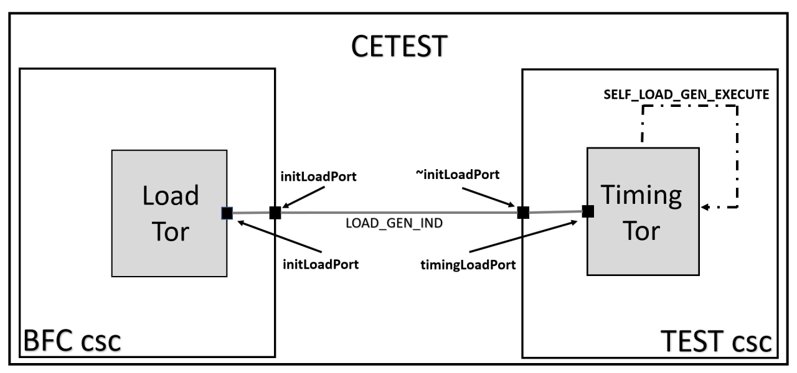
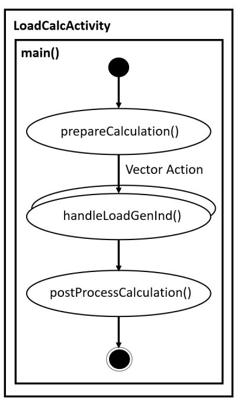
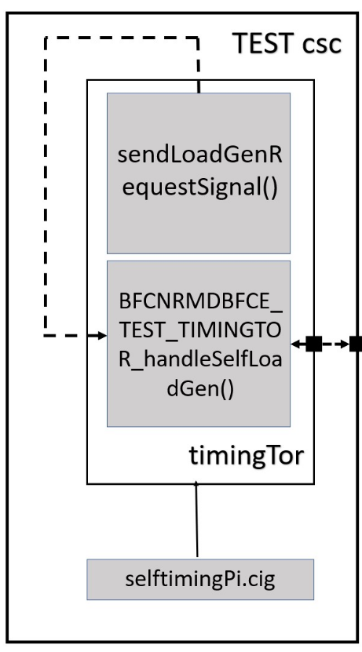

# Load Generator
## 1. General Description
#### This section is about a general description of a load generator where a CBB model is used to generate load. It is possible to configure the number of DSPs used, allocate some memory through the fixed size buffers and also use the allocated memory while the thread is running.

## 3. Ports and Connections
#### Ports are created to establish a connnection between a BFC EMCA and TEST EMCA, inside CETEST csc. LOAD_GEN_IND Signal and a protocol are defined using *InOut <LoadGeneratorConfigS, void> LOAD_GEN_IND*. In **BFCNRMDBFCE_TEST_loadTor.cbc** *initLoadPort* is created. 

#### In **BFCNRMDBFCE_BFC_sc.csc** file initLoadPort is assigned with initLoadPi protocol and a connection between BFC and LoadTor is established using *initLoadPort <--> loadTor.initLoadPort*.

## 4. BFC and LoadTor:
#### A Tor file named BFCNRMDBFCE_TEST_loadTor.cbc is created on the BFC EMCA, where CBC stands for CBB Behavior Class (CBC). A connection is established between BFC and loadTor using a protocol *initLoadPi* and port *initLoadPort*. LOAD_GEN_IND Signal is defined and is mapped to an activity function.

#### A structure named LoadGeneratorConfigS is created in **initLoadPi.ifx** file with all parameters needed for generating load. This structure includes parameters like startTimeUs, endTimeUs, taskSize and noOfBuffers[].

### A) Activity Function:
#### BFCNRMDBFCE_TEST_loadTor::LoadCalActivity() function belongs to the CBC BFCNRMDBFCE_TEST_loadTor. The number of DSPs used is allocated and this functions helps in executing the Signal Handler function, Prepare Calculation function and Post Prepare Calculation Function.

### B) Prepare Calculation Function:
#### *BFCNRMDBFCE_TEST_LOADTOR_prepareCalculation()* function takes CM Pointer (*cmThis_p*) and a received signal (*signIn_p*) as parameters. This function is used to set the number of DSPs used by assigning the Vector Size of activity function with taskSize value, by using BFCNRMDBFCE_TEST_LOADTOR_LoadCalcActivity_myVectorSize_set(sizeUp); where sizeUp is the value of the taskSize.

### C) Signal Handler Function:
#### A signal handler function named *BFCNRMDBFCE_TEST_LOADTOR_handleLoadGenInd()* is created for loadTor. This function uses the information from Payload received from the signal helping in allocating the required number of desired buffers of sizes varying from 16 bits to 1024 bits, which is followed by performing read and write operations on allocated memory. Then the memory is freed to avoid the memory leak issues.

#### The pointer array allocatedBuffers_p[]is used in memory alloacation. athe variable bufferSizeIndex takes 7 values varying from 0 to 7, where 0 is used for allocating 16 bits of memory, 1 allocates 32 bit and so on till 7, where allocatedBuffers_p[7] allocates 1024 bits of memory. Number of buffers needed is controlled by using the array noOfBuffers[].

#### Memory allocation is done by using a while loop inside a for loop. The allocation is done by using *allocatedBuffers_p[bufferStoreIndex - 1] = LPP_allocCm(pow(2, (4 + bufferSizeIndex)));*. The operation pow(2, (4 + bufferSizeIndex)) is used to allocate the memory according to the requested buffer size. If the bufferSizeIndex is 0, then it allocates 16 bits (2 raised to the power of 4 = 16) of memory.

### Example:
#### Consider a case where 3 buffers of 16 bit size and 5 buffers of 64 bit size are needed. Then noOfBuffers[] = [3, 0, 5, 0, 0, 0, 0]. In this array 3 and 5 indicates the number of buffers needed. Zeroth position refers to 16 Bit buffer, First position refers 32 bit and similarly seventh bit refers to 1024 bits. Here the loop will be executed for three times and thus allocating a size of three 16 bit memory and 0 times for 32 bit and again 5 times for 64 bit memory and zero times for other buffer sizes. Write and Read operations are performed on the allocated memory.

### D) Post Process Calculation:
#### After the Payload is used, it is important to free the payload to avoid the memory leak issues. *BFCNRMDBFCE_TEST_LOADTOR_postProcessCalculation()*  also takes CM Pointer (*cmThis_p*) and a received signal (*signIn_p*) as parameters. cbb_signal_freePayLoad(signIn_p); is used to free the PayLoad.

  

## 5. TEST and timingTor:
#### A Tor named BFCNRMDBFCE_TEST_timingTor is created inside the TEST csc. TimingTor is used to send the signals according to the fixed slots. At the begining of every slot the startTimeUs will be added with an offset, helping in sending signals after fixed interval of time. A connection is established between TEST and timingTor using *initLoadPort <--> timingTor.timingLoadPort*. A signal (SELF_LOAD_GEN_EXECUTE) to self is created using *In<void, void> SELF_LOAD_GEN_EXECUTE;* and is mapped to **BFCNRMDBFCE_TEST_TIMINGTOR_handleSelfLoadGen** function using  *SELF_LOAD_GEN_EXECUTE --> BFCNRMDBFCE_TEST_TIMINGTOR_handleSelfLoadGen();*.

### A) Send Request Signal:
#### A function named sendLoadGenRequestSignal() is created which takes timeStampBegin and cmThis_p pointer as parameters. In this function a structure variable, loadTime is created and start time is obtained by using the configuration function *TestConfig_getLoadGenConfig(&loadTime);*. Then an offset is added to the startTime using *LPP_bfnAddOffset(timeStampBegin, startTime * uS);* and a new payload is created to send timerReqLoadTest. 

### B) Signal handle Function:
#### A signal handler function named *BFCNRMDBFCE_TEST_TIMINGTOR_handleSelfLoadGen()* is created which takes cmThis_p and signIn_p parameters. A structure variable, loadGeneratorParams is created and a get function, *TestConfig_getLoadGenConfig(&loadGeneratorParams);* is used set the payload. The payload is sent through LOAD_GEN_IND signal to the BFC.

## 6. Test_Config
#### The set function, *TestConfig_setLoadGenConfig(LoadGeneratorConfigS* loadGenConfig_p)* and the get function *TestConfig_getLoadGenConfig(LoadGeneratorConfigS* loadGenConfig_p)* are declared in the **test_config.c** file and later included in the **test_config.h** file. Set function is used to configure the taskSize and timing variables, whereas get function is used to send the LOAD_GEN_IND and to set the payload.

